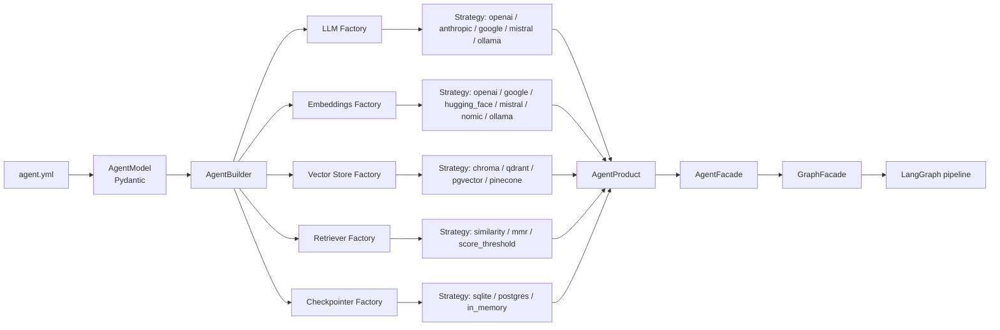

# Agent Factory

A portfolio project: a framework for RAG agent built on [LangGraph](https://github.com/langchain-ai/langgraph), designed around a pluggable **strategy + factory + registry** architecture. Every moving part, such as LLM, embeddings, vector store, retriever, data ingestion, checkpointer, is swappable via YAML, with no code changes, whether you're running fully local or fully in the cloud.

## Architecture

```
Agent YAML  →  Pydantic model (validation)  →  AgentBuilder  →  Factory + Registry  →  Strategy  →  AgentProduct  →  Facade  →  LangGraph
```



### Design patterns in play

**Builder** — `AgentBuilder` (`src/application/builder/agent/agent_builder.py`) assembles an `AgentProduct` step by step: `set_llm_model()`, `set_embeddings_model()`, `set_vector_store()`, `set_retriever()`, `set_data()`, `set_checkpointer()`, each a no-op if that section is absent from the YAML. Every step reads its slice of the validated `AgentModel`, resolves the right factory, and stores the result on the product being built. `GraphBuilder` (`src/application/builder/graph/graph_builder.py`) does the same for the LangGraph pipeline itself — wiring nodes/edges from an already-built `AgentProduct`. Both share a common `Builder` base per module (`builder/agent/base.py`, `builder/graph/base.py`).

**Strategy + Factory + Registry** — each component type has its valid options in a `StrEnum` (e.g. `EnginesTypes`, `ProviderType`, `SaverType`), a `registry` mapping enum members to strategy classes (`@registry.register(EnumMember)`), and a `factory` that resolves the right strategy class at runtime from the YAML value. Adding a new provider (say, a new vector store) is: add an enum member, add a `@registry.register(...)`-decorated strategy class — done, no other file changes.

**Facade** — the rest of the app never talks to builders/factories/strategies directly. Two facades are the entire public surface:
- `AgentFacade.build_from_yaml()` (`src/application/facade/agent_facade.py`) turns a validated `AgentModel` into a fully-wired `AgentProduct` (LLM, embeddings, vector store, retriever, checkpointer), driving `AgentBuilder` internally.
- `GraphFacade.run_graph()` (`src/application/facade/graph_facade.py`) takes that `AgentProduct` and a user message, builds/compiles the LangGraph pipeline via `GraphBuilder`, and returns the response. The CLI (`src/adapters/cli/chat.py`) only ever calls these two methods.

**Lazy loading** — every strategy's `create`/`initialize` method imports its SDK *inside the method body*, not at module top-level (e.g. `from langchain_pinecone import PineconeVectorStore` inside `PineconeVectorStoreStrategy.create`, same for Chroma, Qdrant, every LLM/embeddings provider). This means the app never eagerly imports `langchain_pinecone`, `langchain_anthropic`, `psycopg_pool`, etc. — only whichever provider your YAML actually selects gets imported and pays its startup cost, even though all of them are installed as dependencies.

**Decorator** — `error_handling()` (`src/decorators/error_handling.py`) wraps every strategy's `create`/`initialize` method. It catches `ModuleNotFoundError` (missing optional package → tells you the exact `uv add` to run), auth-shaped `ValueError`/`TypeError` (missing/invalid API key → clear "authentication failure" message), and anything else (wrapped with strategy name + original error) — so a bad Pinecone key or a forgotten `langchain-mistralai` install fails with an actionable message instead of a raw SDK traceback.

## Supported providers

| Component | Options |
|---|---|
| LLM | `openai`, `anthropic`, `google`, `mistral`, `ollama` |
| Embeddings | `openai`, `google`, `hugging_face`, `mistral`, `nomic`, `ollama` |
| Vector store | `chroma`, `qdrant`, `pgvector`, `pinecone` |
| Retriever | `similarity`, `similarity_score_threshold`, `mmr` |
| Checkpointer | `sqlite`, `postgres`, `in_memory` |
| Data loader | `pdf` |
| Data splitter | `recursive_character` |

## Project structure

```
src/
  domain/
    models/                  # Pydantic models per config section (LLMModel, VectorStoreModel, ...)
    factories/                # StrEnum + registry + factory, one folder per component type
    service/                   # Strategy implementations (actual SDK wiring, lazily imported)
  application/
    builder/                   # AgentBuilder (assembles an AgentProduct from AgentModel)
                                # GraphBuilder (assembles the LangGraph pipeline)
    facade/                    # AgentFacade, GraphFacade — the only entrypoints the CLI calls
    graph/                     # LangGraph nodes, state, tools
    services/                  # IngestionService (chunk + embed + upsert documents)
  adapters/
    cli/                       # Interactive YAML picker + chat loop (Rich-based)
    loaders/                   # YAML loader
  decorators/                  # error_handling() — wraps every strategy's create/initialize
config/
  yml/agents/                  # Agent configs. Only *.yml.template is committed — real *.yml
                                # files (with local paths / cloud settings) are gitignored.
  yml/metadata/                 # Per-document metadata catalogs used to enrich RAG (see below)
  markdown/system_prompt.md    # System prompt injected into every agent
docker-compose.yml             # Local Postgres for the checkpointer
.env.example                   # Env vars template for cloud providers
```

## Quickstart — local-only stack

Everything runs on your machine: [Ollama](https://ollama.com/) for both chat and embeddings, Chroma for vectors, SQLite for checkpointing.

```bash
uv sync
ollama pull llama3.1:8b
ollama pull mxbai-embed-large:latest

cp config/yml/agents/agent.yml.template config/yml/agents/my_agent.yml
# fill in the fields (any filename works — the CLI lists every *.yml it finds)

uv run main.py --reset   # ingest documents from ./data and populate the vector store
uv run main.py           # pick your config from the interactive list, start chatting
```

## Quickstart — cloud stack

LLM on OpenAI, embeddings on Gemini, vectors on Pinecone, checkpointer on a local Postgres (via Docker) — a copy-pasteable example lives in `config/yml/agents/cloud.yml.template`.

```bash
cp .env.example .env
# fill in OPENAI_API_KEY, GOOGLE_API_KEY, PINECONE_API_KEY

docker compose up -d              # local Postgres for the checkpointer

cp config/yml/agents/cloud.yml.template config/yml/agents/my_cloud_agent.yml
uv run main.py --reset
uv run main.py
```

Only `agent.yml.template` and `cloud.yml.template` are committed (blueprints, no real values). Locally, this repo also keeps a set of real, gitignored `agent_<component>_<provider>.yml` files — one per provider (`agent_llm_anthropic.yml`, `agent_embeddings_nomic.yml`, `agent_vectorstore_qdrant.yml`, ...) — used to exercise each integration in isolation while developing. Copy the pattern for your own local testing; they never leave your machine.

## Document metadata (RAG enrichment)

Besides the raw files under `data_informations.data_path`, an agent can point to a metadata catalog (`data_informations.metadata_storage` + `metadata_path`) — see `config/yml/metadata/agent_metadata.yml.template`. It maps each source document to an `institution` and a set of `categories`, each with trigger `keywords`. This lets the ingestion/retrieval pipeline associate chunks with richer context (source, domain, relevant terms) instead of relying on raw text alone. It's optional: `metadata_storage`/`metadata_path` can be omitted entirely (`DataInformationsModel` only requires them together, never individually).

## CLI usage

```bash
uv run main.py                 # interactive: pick a config, chat
uv run main.py --ingest        # also ingest new documents into the vector store (incremental)
uv run main.py --reset         # wipe and re-ingest the vector store from scratch
uv run main.py --config <path> # (reserved for future non-interactive use)
```

`AgentSelectorCLI` lists every `*.yml`/`*.yaml` under `config/yml/agents/` with its LLM/embedding provider, so you can flip between local and cloud agents without touching code.

## Environment variables

See `.env.example`. Only the providers you actually reference in a YAML need their key set; everything else can stay empty. Postgres credentials are **not** read from env — they go straight into the YAML's `checkpointer.connection_path` as a full connection string (see `docker-compose.yml` for the local dev defaults).

## Notes

This is a portfolio project meant to demonstrate architectural patterns (builder, strategy/factory/registry, facade, decorator, lazy loading) applied to an LLM agent stack — not a production-hardened service.
